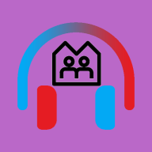

# Musharing-Android &middot;   

> A New Way of Music Sharing in the Internet Era

**Musharing** is a *Android* app for immediate sharing music via Internet with your friends. It offers your the possibility of simulcasting a song in different phones no metter how far apart they are.  More attractive, with musharing, you can chat with your friends in the background of real synchronized music playing.

Wondering more about **musharing** ? [Tap Here(Simplified Chinese)](./musharing.md).

> **This repositories is the *Android app of Musharing*, if you are seek the Back-End of Musharing please [click here]()**

## Getting started

Download Musharing apk [here](./relase) for test.

## Developing

The development of Android platform has realized [a primitive Demo](./release/musharing-demo.apk) that can display some functions of Musharing.

[Click here](./TODO.md) to peek what we are going to do as well as what we have already done.

## Licensing

MIT License

Copyright (c) 2019 Musharing Team

Permission is hereby granted, free of charge, to any person obtaining a copy
of this software and associated documentation files (the "Software"), to deal
in the Software without restriction, including without limitation the rights
to use, copy, modify, merge, publish, distribute, sublicense, and/or sell
copies of the Software, and to permit persons to whom the Software is
furnished to do so, subject to the following conditions:

The above copyright notice and this permission notice shall be included in all
copies or substantial portions of the Software.

THE SOFTWARE IS PROVIDED "AS IS", WITHOUT WARRANTY OF ANY KIND, EXPRESS OR
IMPLIED, INCLUDING BUT NOT LIMITED TO THE WARRANTIES OF MERCHANTABILITY,
FITNESS FOR A PARTICULAR PURPOSE AND NONINFRINGEMENT. IN NO EVENT SHALL THE
AUTHORS OR COPYRIGHT HOLDERS BE LIABLE FOR ANY CLAIM, DAMAGES OR OTHER
LIABILITY, WHETHER IN AN ACTION OF CONTRACT, TORT OR OTHERWISE, ARISING FROM,
OUT OF OR IN CONNECTION WITH THE SOFTWARE OR THE USE OR OTHER DEALINGS IN THE
SOFTWARE.